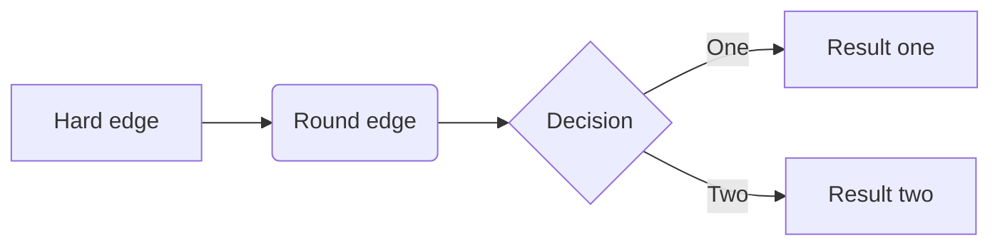

# Here
### H
```c++
#include <it>
void main()
{
    return 0;
}
```


$x+y=z$

$$x+y=z$$

```
dfgd
```



```mermaid
graph LR
A[Hard edge] -->B(Round edge)
    B --> C{Decision}
    C -->|One| D[Result one]
    C -->|Two| E[Result two]
```


