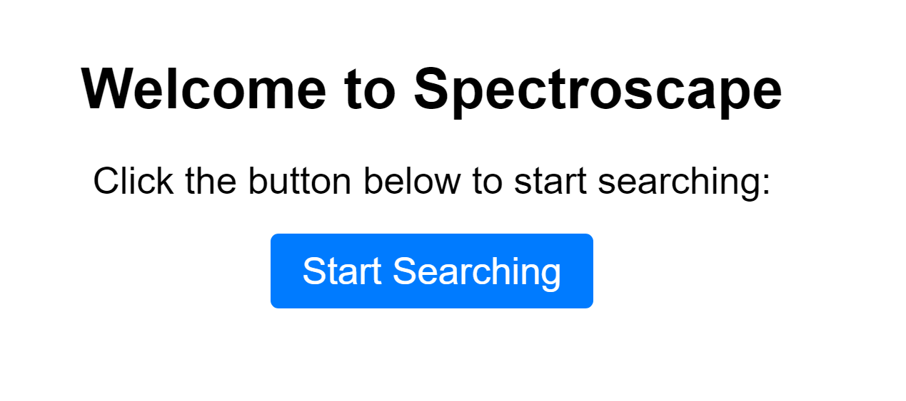
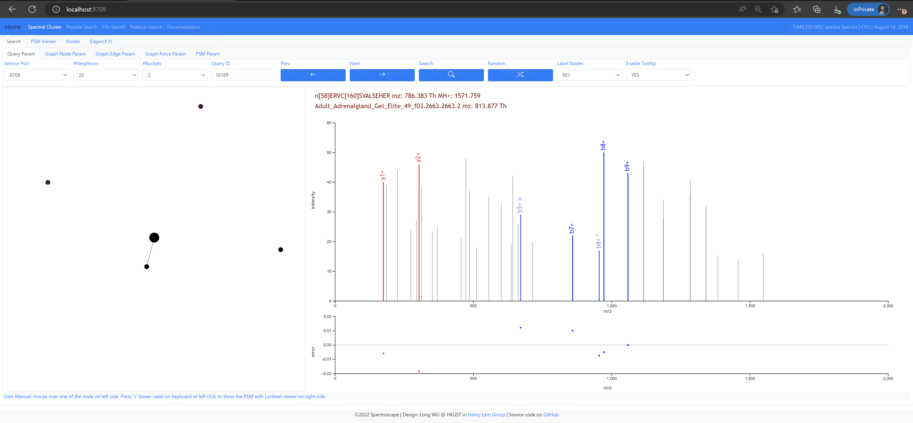

# Spectroscape


> **Announcement:**  
> We created our first DOI badge from Zenodo. Future releases may also come with DOI links. 
>
> [](https://zenodo.org/badge/latestdoi/505467760)
>
>
> Currently, Zenodo release (as well as GitHub source code package) does not contain the web UI submodule. Therefore, please get our newest source code from GitHub release page to test. Please refer to the [Source code installation](#source-code-installation) part for detailed steps.  
>
> Sep. 13, 2023
> 
> Now there are three demos available.   
> Demo 1: an archvie with 25 million spectra. [http://spectroscape.cc](http://spectroscape.cc)  
> Demo 2: a demo archive with 25 data files, ~350,000 spectra. [http://spectroscape.cc:8709](http://spectroscape.cc:8709)  
> Demo 3: an archive with > 100 million spectra. [http://omics.ust.hk:8709](http://omics.ust.hk:8709)   
> Aug 23. 2023  in HKUST
>
> Our server now is switched to use default port 80. Please visit: [http://spectroscape.cc](http://spectroscape.cc) for an demo spectral archive. We temporarily turn off the demo on port 8709.     
> July 31, 2023   
> 
> Our server in HKUST was shut down during the weekend due to a electricity suspension. Now the spectroscape demo is back online.   
> Please visit [http://spectroscape.cc:8709](http://spectroscape.cc:8709)  for an demo spectral archive with over 25 million spectra.  
> June 26, 2023 in HKUST  
>  
> We made our spectral archive search demo available on the following website.  
> [http://spectroscape.cc:8709](http://spectroscape.cc:8709)  
> We will keep this domain in the near future and make our Spectroscape available to everyone.     
> June 23, 2023  


Spetroscape is a software tool to search for similar PSMs in spectral archives. It can create a spectral archive, and incrementally add new data (mzML/mzXML) and annotations (pep.xml) to it. 

Spectroscape has a web user interface, which enables real time searching for approximate nearest neighbors (ANNs) against an archive with hundreds of millions of spectra. 


## Video tutorial for installation
For installation, users may either follow the [YouTube video tutorial](https://youtu.be/C1a9RUqPxYs) below or read through the next section of the ReadMe.md file.  


[](https://youtu.be/C1a9RUqPxYs)

If you would like to use Spectroscape directly via brower, [click here](http://omics.ust.hk/index.html). 

[](http://omics.ust.hk/index.html)


## Binary installation 
This following command has been tested on **Ubuntu 22.04 and 20.04**.  The .deb file of latest version of spectroscape can be found in the following [link](https://github.com/wulongict/SpectralArchive/releases/latest). 

Spectroscape comes with both CPU and GPU versions. If CUDA environment is not available, please use CPU version.  

Spectroscape (CPU version) can be installed using following command lines. 
```bash
wget https://github.com/wulongict/SpectralArchive/releases/download/v1.1.5/Spectroscape_CPU-1.1.5.deb
sudo apt update
sudo apt install ./Spectroscape_CPU-1.1.5.deb

```

In case that the user do not have root privilege, the following command could be used.
```bash 
wget https://github.com/wulongict/SpectralArchive/releases/download/v1.1.5/Spectroscape_CPU-1.1.5.deb
dpkg -x ./Spectroscape_CPU-1.1.5.deb ./
```


The [GPU version](https://github.com/wulongict/SpectralArchive/releases/download/v1.1.5/Spectroscape_GPU-1.1.5.deb) can be installed similarly. 


```bash
wget https://github.com/wulongict/SpectralArchive/releases/download/v1.1.5/Spectroscape_GPU-1.1.5.deb
sudo apt update
sudo apt install ./Spectroscape_GPU-1.1.5.deb
```

However, users should first make sure CUDA environment available. Otherwise, the following error occurs when running spectroscape. 

```bash
spectroscape

spectroscape: error while loading shared libraries: libcudart.so.11.0: cannot open shared object file: No such file or directory
```

## Uninstallation
use the following command line to remove spectroscape (both GPU and CPU versions) from Ubuntu system. 
```bash
sudo apt remove spectroscape_cpu spectroscape_gpu
```

## Source code installation

### Prerequisites
This following command has been tested on Ubuntu 22.04. It does not compile on older versions because of the `cmake_minimum_required` parameter. 
`cmake` and `gcc` are required to compile of C++ code.  
```bash
sudo apt update
sudo apt install cmake build-essential 
```

The source code requires two extra libraries, `libfcgi` and `liblapack`. 

```bash
sudo apt install libfcgi-dev liblapack-dev 
```

To make the web interface work, two more tools should be installed, `spawn-fcgi` and `nginx`. 
```bash
sudo apt install spawn-fcgi nginx
```

Finally, to compile GPU version, CUDA environment is required. 

### Compile

First, get the latest source code of spectroscape from GitHub. 

```bash
 git clone --recurse-submodules  https://github.com/wulongict/SpectralArchive.git --branch release
```

Start from here, all the command should be executed under the source code folder, namely, SpectralArchive. 

Run the following scripts to remove any intermediate files and have a clean start. 
```bash
./cleanMake.bash
```

Users can compile a CPU or GPU version using option FALSE or TRUE. 

```bash
# CPU version
./compile.bash FALSE
```

```bash
# GPU version 
./compile.bash TRUE
```

After the compilation, the executable files are under the build/bin folder inside the source code directory. 
```bash
build/
├── bin
├── include
├── lib
└── share
```

## Usage
### Build archive
First create a new folder, e.g. `mass_spectra`. Then put some raw files in it. Here we using following files as example. Note that the minimum number of spectra required to initialize a spectral archive by Spectroscape is 100,000. Using only one mzXML file is not adquate to build an archive. Please try download the following files from [this link](https://drive.google.com/drive/folders/1i31NY48YW6_dy1M_xyF9OCdGIKekA1Xq?usp=sharing) to Google Drive. Users could also download [the compressed version](https://drive.google.com/drive/folders/1ZaHdkzxclzYboYf_67pPxgkmFxpnVFAG?usp=sharing) from Google Drive. 

```bash
$ ls mass_spectra
Adult_Adrenalgland_Gel_Elite_49_f01.mzXML
Adult_Adrenalgland_Gel_Elite_49_f02.mzXML
Adult_Adrenalgland_Gel_Elite_49_f03.mzXML
Adult_Adrenalgland_Gel_Elite_49_f04.mzXML
Adult_Adrenalgland_Gel_Elite_49_f05.mzXML
Adult_Adrenalgland_Gel_Elite_49_f06.mzXML
Adult_Adrenalgland_Gel_Elite_49_f07.mzXML
Adult_Adrenalgland_Gel_Elite_49_f08.mzXML
Adult_Adrenalgland_Gel_Elite_49_f09.mzXML
Adult_Adrenalgland_Gel_Elite_49_f10.mzXML
Adult_Adrenalgland_Gel_Elite_49_f11.mzXML
Adult_Adrenalgland_Gel_Elite_49_f12.mzXML
Adult_Adrenalgland_Gel_Elite_49_f13.mzXML
Adult_Adrenalgland_Gel_Elite_49_f14.mzXML
Adult_Adrenalgland_Gel_Elite_49_f15.mzXML
Adult_Adrenalgland_Gel_Elite_49_f16.mzXML
Adult_Adrenalgland_Gel_Elite_49_f17.mzXML
Adult_Adrenalgland_Gel_Elite_49_f18.mzXML
Adult_Adrenalgland_Gel_Elite_49_f19.mzXML
Adult_Adrenalgland_Gel_Elite_49_f20.mzXML
Adult_Adrenalgland_Gel_Elite_49_f21.mzXML
Adult_Adrenalgland_Gel_Elite_49_f22.mzXML
Adult_Adrenalgland_Gel_Elite_49_f23.mzXML
Adult_Adrenalgland_Gel_Elite_49_f24.mzXML

```

The raw files corresponding to the mzXML files below can be downloaded from pride archive [PXD000561](http://ftp.ebi.ac.uk/pride-archive/2014/04/PXD000561/).


Second, create another folder, e.g. `spectral_archives`. Initialized the archive using following command. 
```bash
mkdir spectral_archives
cd spectral_archives 

# spectroscape --init --datasearchpath <path-to-folder-with-mass-spectra-data>
# here we assume the spectral_archives folder and mass_spectra are in the same path. 

spectroscape --init --datasearchpath ../mass_spectra/

spectroscape --run

```

After this step, spectroscape creates a spectral archive using the data in `../mass_spectra/` with default parameters in `./conf/spectroscape_auto.conf`. 

### Add new data/annotation to existing spectral archive: 
#### supported data format
The spectral archive can be expanded to include more MS data file.  Currently, it supports the following input formats of MS data file.
- mzXML
- mzML
- sptxt
  
#### supported annotation file format
The spectral archive should be properly annotated. Currently, it supports the following input format.
- .pep.xml file generated by xinteract or search engine (e.g. Comet)
- spectral library .sptxt 
- text format .spectroscape.tsv 

For the last tsv format, please follow the example file in `tests/data/example.spectroscape.tsv`. Here is how the format looks like. The first line is header and should not be changed. 
```bash
filename        scan    modpep  charge  protein ppprob  iprob   score
../mass_spectra/Adult_Adrenalgland_Gel_Elite_49_f01.mzXML       2       HGSGTGR 2       sp|A6NLU5|VTM2B_HUMAN   0.0     0.0     1.373
../mass_spectra/Adult_Adrenalgland_Gel_Elite_49_f01.mzXML       11      RKQEEADR        3       sp|Q05682|CALD1_HUMAN   0.0     0.0     2.435
../mass_spectra/Adult_Adrenalgland_Gel_Elite_49_f01.mzXML       60      HNGTGGK 2       sp|P62937|PPIA_HUMAN    0.0     0.0     3.329
../mass_spectra/Adult_Adrenalgland_Gel_Elite_49_f01.mzXML       484     HGNSHQGEPR      3       sp|P13645|K1C10_HUMAN   1.0     0.999999        0.0001883
../mass_spectra/Adult_Adrenalgland_Gel_Elite_49_f01.mzXML       496     QMHQNAPR        2       sp|Q9NSI6|BRWD1_HUMAN   0.1448  0.00492768      1.489
../mass_spectra/Adult_Adrenalgland_Gel_Elite_49_f01.mzXML       500     IDIFQTQAEQCHIAGISQKGWNFNR       5       DECOY_sp|P47755|CAZA2_HUMAN     0.0     0.0     1.792
../mass_spectra/Adult_Adrenalgland_Gel_Elite_49_f01.mzXML       501     VQGQNLDSMLHGTGMK        3       sp|P36894|BMR1A_HUMAN   0.0     0.0     2.722
../mass_spectra/Adult_Adrenalgland_Gel_Elite_49_f01.mzXML       514     EILKIDGSNTVDHK  4       sp|Q8IZH2|XRN1_HUMAN    0.0     0.0     2.151
../mass_spectra/Adult_Adrenalgland_Gel_Elite_49_f01.mzXML       517     HGNSHQGEPR      3       sp|P13645|K1C10_HUMAN   1.0     0.999999        2.31e-05
```


#### The simplest way to add data files and search results 
The following command line will add new data and annotation files into the existing archive.

```bash
spectroscape --add --datasearchpath /path/to/new/data 
```

Note that spectroscape will search for data (mzXML/mzML/sptxt) and annotation (.spectroscape.tsv/ipro.pep.xml/pep.xml) files recursively. Therefore new data can be organized into multiple sub-folders. 

To get better control on the new data files added (e.g. excluding certain files), one can follow the command line explained in next section. 
#### Use a specific pepXML as annotation

Run the following command to update the annotation of spectra in the 24 mzXML used above. One can get the interact-Adult_Adrenalgland_Gel_Elite_49.ipro.pep.xml file from a Comet+xinteract database searching pipeline in TPP.
```bash
spectroscape --run --update --updategt interact-Adult_Adrenalgland_Gel_Elite_49.ipro.pep.xml
```

### Add a specific MS data file 
Run the following command to add a new mzXML/mzML file.
```bash
spectroscape --run --update --updaterawdata <input>.mzXML
```


### Search against a archive
#### Search a given mzXML file
Run the following command can be used to search a data file. Before searching against an archive, make sure the spectral archive is annotated by search results under FDR control, e.g. annotated by pepXML files of iProphet/PeptidePropeht. 

```bash
spectroscape --run --inputsource cmd --datafile <input>.mzXML
```

### Web UI
To use the web UI, users should also download the SpectralArchiveWeb repository. If the installation is done with source code, then `SpectralArchiveWeb` is already included as submodule. Here we briefly show how the web UI can be launched. For a detailed explanation of the web UI, please refer to the [README.md](https://github.com/wulongict/SpectralArchiveWeb/blob/main/README.md) file in `SpectralArchiveWeb` folder. 

To open the web interface, users should navigate to the `SpectralArchiveWeb/scripts` folder and run the following command. The second command requires `sudo`. 

```bash
./generate_nginx_conf.bash localhost all ../arxiv/

# the following command will require root privilege.
./start_nginx_server.bash

```

The command lines above will open the nginx service on local computer. Then go to the spectral archive folder, and run the following command. 

```bash 
# absolute path to spectroscape is required, that is why we use `which spectroscape` 
# the port 8710 is currently hardcoded into the nginx configuration file, therefore do not change it. 
# the only thing can be changed accordingly is the path to the SpectralArchiveWeb/arxiv/ folder. 
spawn-fcgi -p 8710 -n -- `which spectroscape` --run --wwwroot ~/SpectralArchive/SpectralArchiveWeb/arxiv/
```
After this step, we can open browser on local computer and go to the following [link: http://localhost:8709](http://localhost:8709 ). The UI will be shown as follows. 



### Video tutorials for web UI
I have made two tutorial videos about how to use the web UI. Here are the links. 


#### Introduction to the web UI

[](https://youtu.be/rp3khWnMdxI)

#### Introduction to the web UI: the butterfly PSM plot


[](https://youtu.be/6h8eFYn9V24)


## Issues
- When running archive tool, I got an error said "libdpgpu.so: cannot open shared object file: No such file or directory"?  
    If the binary of archive tool is called /path/to/archive/bin, then try add the library path, /path/to/archive/lib to LD_LIBRARY_PATH variable.
    One can check the RUNPATH of a binary or library file with following command: 
    ```bash
    objdump -x /path/to/the/binary-or-library-file | grep RUNPATH
    ```

